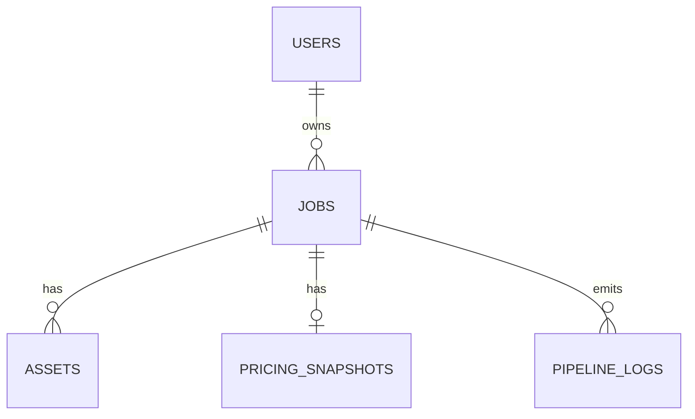

# Database Documentation

## Overview

ContentPro stores users, jobs, assets, pricing, and pipeline log events in a relational database.

Current setup:
- development: SQLite
- production: PostgreSQL

The ORM is SQLAlchemy async. The production app currently runs against Postgres on the DigitalOcean droplet.

## Important Current-State Notes

- The `jobs` table includes `batch_id` and `batch_name`
- Soft delete is implemented by setting `jobs.status = 'deleted'`
- There is no `deleted_at` column on `jobs`
- `pipeline_logs.job_id` references the internal UUID-style `jobs.id`, not the public `jobs.job_id`
- The live production schema includes manual additions that are not yet fully captured in Alembic history

## Core Tables

### `users`

Purpose:
- account identity and authentication

Current columns:
- `id`
- `email`
- `hashed_password`
- `display_name`
- `plan`
- `created_at`
- `updated_at`

Notes:
- current auth mode is email/password
- do not assume bcrypt specifically; password hashing implementation changed during development

### `jobs`

Purpose:
- one row per single job or per batch row

Current columns:
- `id`
- `job_id`
- `user_id`
- `brand_name`
- `brand_website`
- `product_name`
- `product_category`
- `job_type`
- `social_link_1`
- `social_link_2`
- `social_link_3`
- `social_link_4`
- `additional_input`
- `video_duration_seconds`
- `status`
- `current_stage`
- `error_message`
- `storage_prefix`
- `created_at`
- `updated_at`
- `batch_id`
- `batch_name`

Important semantics:
- `id`: internal PK used in FKs
- `job_id`: public timestamp-style ID used in APIs and UI
- `batch_id`: groups multiple job rows into one batch card
- `batch_name`: display name for the batch

Status values used in practice:
- `pending_upload`
- `pending`
- `running`
- `completed`
- `failed`
- `deleted`

### `assets`

Purpose:
- source inputs and generated outputs

Current columns:
- `id`
- `job_id`
- `asset_type`
- `stage`
- `storage_key`
- `original_filename`
- `mime_type`
- `size_bytes`
- `metadata`
- `is_deleted`
- `created_at`

Important asset types in active image flow:
- `raw_image`
- `generated_image`
- `kyc_json`
- `filtered_kyc_json`
- `job_log`
- `pricing_report`

Notes:
- source images and generated files are linked to a job through internal `jobs.id`
- storage key points to local storage or DO Spaces, depending on environment

### `pricing_snapshots`

Purpose:
- per-job cost and token snapshot

Current columns:
- `id`
- `job_id`
- `raw_price_data`
- `total_cost_usd`
- `stage_1_cost_usd`
- `stage_2_cost_usd`
- `stage_3_cost_usd`
- `stage_4_cost_usd`
- `total_input_tokens`
- `total_output_tokens`
- `created_at`

Notes:
- image jobs actively populate stage 1 and stage 2 costs
- stage 3 and stage 4 fields exist because the original broader plan included video

### `pipeline_logs`

Purpose:
- structured execution logs shown in the UI and used for debugging

Current columns:
- `id`
- `job_id`
- `level`
- `stage`
- `message`
- `context`
- `logged_at`

Notes:
- the frontend job-detail view reads these logs through `GET /jobs/{job_id}/logs`
- live status messages are also emitted over SSE

## Relationships

## Batch Data Model

Batches do not have a standalone table.

Instead:
- each batch row is still a normal `jobs` row
- related rows share:
  - `batch_id`
  - `batch_name`

This powers:
- grouped batch cards on the Projects page
- batch detail pages
- batch ZIP downloads

## Current Production Compatibility

Verified on the live droplet database:
- `jobs.batch_id` exists
- `jobs.batch_name` exists
- `users`, `assets`, `pricing_snapshots`, and `pipeline_logs` contain the columns required by the current code

Current live Alembic version:
- `20260311_0002`

Important caveat:
- the live DB is compatible with the code
- the migration history is not complete because batch columns were added manually later

## Recommended Next DB Task

Create a new Alembic migration that explicitly adds:
- `jobs.batch_id`
- `jobs.batch_name`

That will make fresh environments reproducible without manual SQL patches.
